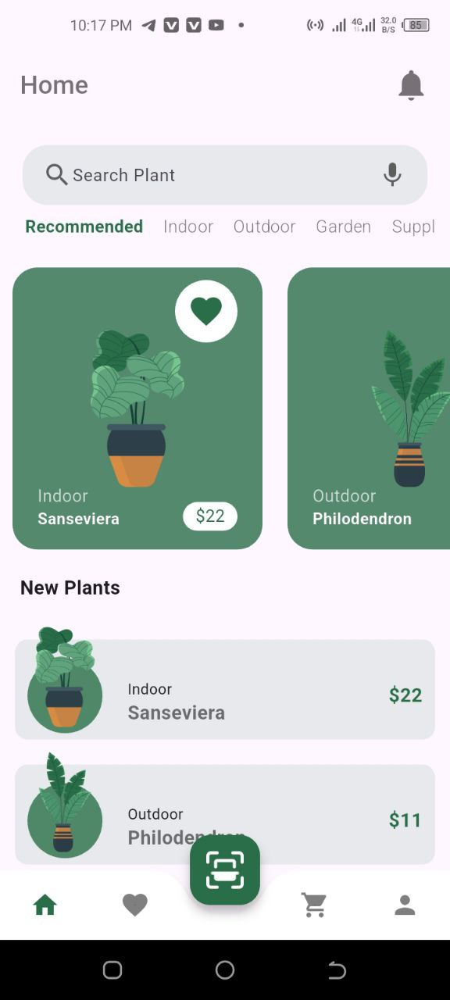
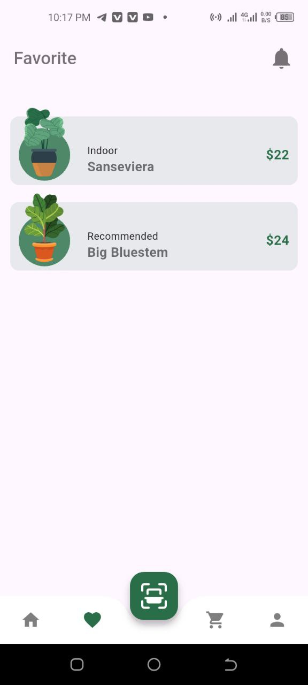
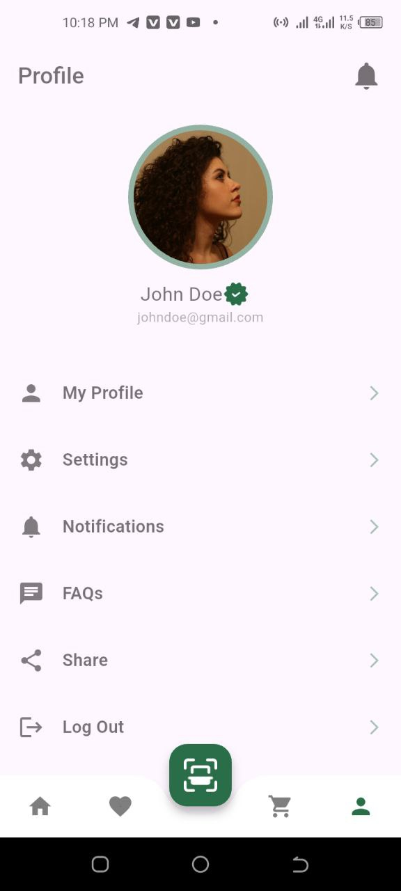

# Plant Lovers App 🌱  

Welcome to the **Plant Lovers App** – a Flutter-based app designed for plant enthusiasts to explore, learn, and manage their favorite plants! This project was created with the help of tutorial videos, and it’s a great example of how to build a feature-rich Flutter app. Whether you're a beginner or an experienced developer, feel free to explore the code and learn from it!  

---

## Features 🌟  

### 1. **Home Page**  
   - Browse a wide variety of plants with beautiful visuals and details.  
   - Learn about different plant species and their care requirements.  

### 2. **Favorites Section**  
   - Save your favorite plants to a dedicated section for easy access.  
   - Never lose track of the plants you love!  

### 3. **Scan Page**  
   - Identify plants using the app's scanning feature (camera integration).  
   - Get instant information about the plants you scan.  

### 4. **Add to Cart**  
   - Add plants to your cart for future reference or purchase.  
   - Manage your cart and explore options to buy your favorite plants.  

### 5. **Profile Page**  
   - Personalize your profile and track your plant collection.  
   - Manage your account settings and preferences.  

### 6. **Authentication**  
   - **Login Page**: Securely log in to your account.  
   - **Sign Up Page**: Create a new account to start your plant-loving journey.  
   - **Forgot Password Page**: Easily reset your password if you forget it.  

---

## Screenshots 📸  

Here are some screenshots of the app to give you a glimpse of its features:  

### Home Page  
  
*Browse through a variety of plants and discover new species.*  

### Favorites Section  
  
*Save and access your favorite plants in one place.*  


### Profile Page  
  
*Manage your profile and track your plant collection.*  


---

## How to Use 🛠️  

1. **Explore Plants**: Start by browsing the home page to discover a variety of plants.  
2. **Save Favorites**: Tap the heart icon to save plants to your Favorites section.  
3. **Scan Plants**: Use the Scan page to identify plants and learn more about them.  
4. **Add to Cart**: Found a plant you love? Add it to your cart for future reference.  
5. **Manage Your Profile**: Customize your profile and track your plant collection.  
6. **Log In/Sign Up**: Create an account or log in to access all features.  
7. **Reset Password**: Use the Forgot Password page to reset your password if needed.  

---

## Project Background 🎥 

This project was developed with the help of tutorial videos. It’s a great resource for learning Flutter development, including:  
- **State Management**: Using `Provider` or `Bloc` (depending on the tutorial).  
- **Firebase Integration**: For authentication and database management.  
- **UI/UX Design**: Creating beautiful and responsive layouts.  
- **Camera Integration**: For the plant scanning feature.  

If you're following a similar tutorial, this project can serve as a reference or a starting point for your own app!  

---

## Getting Started 🚀  

To run this project locally, follow these steps:  

1. **Clone the Repository**:  
   ```bash  
   git clone https://github.com/anchirinaahhezekiah/plant_app.git  
   ```  

2. **Navigate to the Project Directory**:  
   ```bash  
   cd plant_app  
   ```  

3. **Install Dependencies**:  
   ```bash  
   flutter pub get  
   ```  

4. **Run the App**:  
   ```bash  
   flutter run  
   ```  

---

## Dependencies 📦  

This app uses the following packages:  
- `firebase_auth`: For user authentication.  
- `cloud_firestore`: For database management.  
- `provider` or `flutter_bloc`: For state management.  
- `camera`: For the plant scanning feature.  
- `shared_preferences`: For local storage of user preferences.  

Make sure to add these dependencies to your `pubspec.yaml` file.  

---

## Contributing 🤝 

Contributions are welcome! If you'd like to improve this project, feel free to:  
1. Fork the repository.  
2. Create a new branch (`git checkout -b feature/YourFeatureName`).  
3. Commit your changes (`git commit -m 'Add some feature'`).  
4. Push to the branch (`git push origin feature/YourFeatureName`).  
5. Open a pull request.  

---

## Acknowledgments 🙏 

A big thank you to the creators of the tutorial videos that helped me build this project! If you're interested in learning Flutter, I highly recommend checking out tutorials on platforms like YouTube, Udemy, or Coursera.  

---


Happy coding, and may your love for plants (and Flutter) continue to grow! 🌿💻
